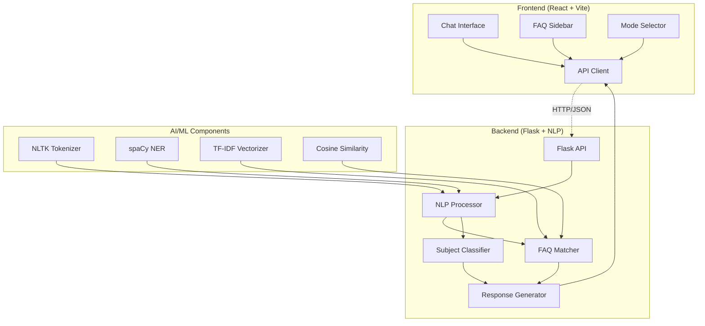

# 🤖 Edubot - AI Chatbot Konsultasi Belajar

<div align="center">


[](https://python.org)
[](https://reactjs.org)
[](https://flask.palletsprojects.com)
[](https://vitejs.dev)
[](https://tailwindcss.com)

**Chatbot berbasis NLP (Natural Language Processing) untuk menjawab pertanyaan umum terkait pelajaran seperti Matematika, Bahasa Inggris, Fisika, dan mata pelajaran lainnya.**

[Demo](#-demo) • [Instalasi](#-instalasi--setup) • [Fitur](#-fitur-utama) • [API](#-api-documentation) • [Kontribusi](#-kontribusi)

</div>

---

## 📋 Daftar Isi

- [Tentang Edubot](#-tentang-edubot)
- [Fitur Utama](#-fitur-utama)
- [Demo](#-demo)
- [Teknologi](#-teknologi-yang-digunakan)
- [Arsitektur](#-arsitektur-sistem)
- [Instalasi & Setup](#-instalasi--setup)
- [Penggunaan](#-penggunaan)
- [API Documentation](#-api-documentation)
- [Struktur Proyek](#-struktur-proyek)
- [Studi Kasus](#-studi-kasus)
- [Pengembangan](#-pengembangan-selanjutnya)
- [Kontribusi](#-kontribusi)

---

## 🎯 Tentang Edubot

Edubot adalah AI Chatbot yang dirancang khusus untuk membantu siswa dalam proses belajar. Menggunakan teknologi Natural Language Processing (NLP) untuk memahami pertanyaan dan memberikan jawaban yang relevan dan akurat untuk berbagai mata pelajaran.

### 🎓 Tujuan Proyek
- Membantu siswa mendapatkan jawaban cepat untuk pertanyaan pelajaran
- Menyediakan platform konsultasi belajar yang accessible 24/7
- Menerapkan teknologi AI/ML dalam bidang pendidikan
- Memberikan pengalaman belajar yang interaktif dan engaging

---

## 🚀 Fitur Utama

### 🤖 **Multi-Mode Operation**
- **Mode Auto** - Kombinasi otomatis FAQ + Direct response
- **Mode FAQ** - Jawaban cepat dari database pertanyaan umum
- **Mode Direct** - Response adaptif menggunakan NLP processing

### 📚 **Multi-Subject Support**
- **Matematika** - Aljabar, Geometri, Kalkulus, Statistik
- **Bahasa Inggris** - Grammar, Vocabulary, Tenses, Writing
- **Fisika** - Mekanika, Termodinamika, Listrik, Optik
- **Kimia** - Reaksi, Unsur, Molekul, Stoikiometri
- **Biologi** - Sel, Organ, Genetika, Ekologi

### 🎨 **User Experience**
- **Real-time Chat Interface** dengan animasi smooth
- **Confidence Scoring** - Menampilkan tingkat kepercayaan jawaban
- **Subject Classification** - Otomatis mengidentifikasi mata pelajaran
- **FAQ Sidebar** - Akses cepat ke pertanyaan populer
- **Responsive Design** - Optimal di desktop dan mobile
- **Dark/Light Mode Support** (coming soon)

### 🧠 **AI/ML Features**
- **NLP Text Processing** - Tokenization, lemmatization, stop words removal
- **TF-IDF Vectorization** - Convert text to numerical representation
- **Cosine Similarity** - Intelligent question matching
- **Intent Recognition** - Understand user's learning intent
- **Context Awareness** - Maintain conversation context

---

## 🎬 Demo

### Screenshot Interface
```
🤖 Edubot - AI Konsultasi Belajar

┌─────────────────────────────────────────────┐
│ 👤 User: "Bagaimana cara menghitung luas    │
│          lingkaran?"                        │
└─────────────────────────────────────────────┘

┌─────────────────────────────────────────────┐
│ 🤖 Edubot: "Luas lingkaran = π × r²        │
│            Di mana π ≈ 3.14 dan r adalah   │
│            jari-jari lingkaran."            │
│                                             │
│    📊 Matematika | FAQ Match | 95% ✓       │
└─────────────────────────────────────────────┘
```

### Video Demo
> 📹 *Demo video akan tersedia setelah deployment*

---

## 🛠️ Teknologi yang Digunakan

<table>
<tr>
<td width="50%">

### **Backend**
-  **Python 3.8+**
-  **Flask** - Web framework
-  **NLTK** - Natural Language Processing
-  **spaCy** - Advanced NLP
-  **scikit-learn** - Machine Learning

</td>
<td width="50%">

### **Frontend**
-  **React 18**
-  **Vite** - Build tool
-  **Tailwind CSS** - Styling
-  **ES6+** - Modern JavaScript

</td>
</tr>
</table>

### **DevOps & Tools**
-  Docker (Optional)
-  Git Version Control
-  API Testing

---

## 🏗️ Arsitektur Sistem



---

## ⚡ Instalasi & Setup

### **Prerequisites**
- Python 3.8+ 
- Node.js 16+ 
- npm/yarn 

### **🐍 Backend Setup**

1. **Clone repository**
```bash
git clone https://github.com/your-username/edubot.git
cd edubot/backend
```

2. **Buat virtual environment**
```bash
python -m venv venv

# Windows
venv\Scripts\activate

# macOS/Linux
source venv/bin/activate
```

3. **Install dependencies**
```bash
pip install -r requirements.txt
```

4. **Download NLP models**
```bash
# Download spaCy English model
python -m spacy download en_core_web_sm

# Download NLTK data
python -c "import nltk; nltk.download('punkt'); nltk.download('stopwords'); nltk.download('wordnet')"
```

5. **Setup environment variables**
```bash
cp .env.example .env
# Edit .env file sesuai konfigurasi Anda
```

6. **Jalankan server**
```bash
python app.py
```
🎉 Backend server running di `http://localhost:5000`

### **⚛️ Frontend Setup**

1. **Navigate ke frontend directory**
```bash
cd ../frontend
```

2. **Install dependencies**
```bash
npm install
# atau
yarn install
```

3. **Setup Tailwind CSS**
```bash
npx tailwindcss init -p
```

4. **Jalankan development server**
```bash
npm run dev
# atau
yarn dev
```
🎉 Frontend running di `http://localhost:5173`

### **🐳 Docker Setup (Optional)**

```bash
# Build dan run dengan Docker Compose
docker-compose up --build
```

---

## 📖 Penggunaan

### **1. Basic Chat**
```javascript
// Kirim pertanyaan ke chatbot
const response = await fetch('/api/chat', {
  method: 'POST',
  headers: { 'Content-Type': 'application/json' },
  body: JSON.stringify({
    question: "Apa itu aljabar?",
    mode: "auto"
  })
})
```

### **2. Mode Selection**
- **Auto Mode**: Otomatis memilih approach terbaik
- **FAQ Mode**: Hanya mencari di database FAQ
- **Direct Mode**: Generate response menggunakan NLP

### **3. Contoh Pertanyaan**

#### Matematika
```
❓ "Bagaimana cara faktoring x² - 4?"
✅ "Faktoring x² - 4 = (x+2)(x-2) menggunakan rumus selisih kuadrat"

❓ "Rumus luas segitiga?"
✅ "Luas segitiga = ½ × alas × tinggi"
```

#### Bahasa Inggris
```
❓ "Apa perbedaan simple past dan present perfect?"
✅ "Simple past untuk kejadian di waktu tertentu di masa lalu..."

❓ "Cara membuat passive voice?"
✅ "Passive voice: Object + to be + past participle"
```

---

## 📡 API Documentation

### **Base URL**
```
http://localhost:5000/api
```

### **Endpoints**

#### **1. Chat Endpoint**
```http
POST /api/chat
Content-Type: application/json

{
  "question": "Apa itu aljabar?",
  "mode": "auto"  // auto | faq | direct
}
```

**Response:**
```json
{
  "answer": "Aljabar adalah cabang matematika yang menggunakan huruf dan simbol...",
  "subject": "Matematika",
  "confidence": 0.95,
  "mode": "faq_match",
  "timestamp": "2025-06-01T10:30:00Z"
}
```

#### **2. FAQ Endpoint**
```http
GET /api/faq
```

**Response:**
```json
{
  "Matematika": [
    {
      "question": "Apa itu aljabar?",
      "answer": "Aljabar adalah cabang matematika..."
    }
  ],
  "Bahasa Inggris": [...],
  "Fisika": [...]
}
```

#### **3. Subjects Endpoint**
```http
GET /api/subjects
```

**Response:**
```json
{
  "subjects": ["Matematika", "Bahasa Inggris", "Fisika", "Kimia", "Biologi"]
}
```

#### **4. Health Check**
```http
GET /api/health
```

**Response:**
```json
{
  "status": "healthy",
  "timestamp": "2025-06-01T10:30:00Z"
}
```

---

## 📁 Struktur Proyek

```
edubot/
├── 📁 backend/
│   ├── 📄 app.py                 # Flask application
│   ├── 📄 requirements.txt       # Python dependencies
│   ├── 📄 .env                   # Environment variables
│   └── 📁 data/
│       └── 📄 faq_data.json     # FAQ database
│
├── 📁 frontend/
│   ├── 📄 package.json          # Node.js dependencies
│   ├── 📄 vite.config.js        # Vite configuration
│   ├── 📄 tailwind.config.js    # Tailwind configuration
│   ├── 📄 index.html            # HTML template
│   └── 📁 src/
│       ├── 📄 main.jsx          # React entry point
│       ├── 📄 App.jsx           # Main App component
│       ├── 📄 index.css         # Global styles
│       └── 📁 components/
│           └── 📄 Edubot.jsx    # Main chat component
│
├── 📄 README.md                 # Project documentation
├── 📄 docker-compose.yml        # Docker configuration
└── 📄 .gitignore               # Git ignore rules
```

---

## 📚 Studi Kasus

### **Case Study 1: Matematika**
```
Scenario: Siswa bertanya tentang konsep aljabar
Input: "Bagaimana cara menyelesaikan persamaan 2x + 5 = 11?"

Process:
1. NLP preprocessing
2. Subject classification → Matematika
3. Pattern matching → Persamaan linear
4. Generate step-by-step solution

Output:
"Untuk menyelesaikan 2x + 5 = 11:
1. Kurangi kedua ruas dengan 5: 2x = 6
2. Bagi kedua ruas dengan 2: x = 3
3. Jadi x = 3"

Confidence: 95% | Mode: Direct | Subject: Matematika
```

### **Case Study 2: Bahasa Inggris**
```
Scenario: Siswa bertanya tentang grammar
Input: "Kapan menggunakan present perfect tense?"

Process:
1. Text analysis
2. Grammar topic identification
3. Rule-based matching
4. Generate explanation with examples

Output:
"Present perfect tense digunakan untuk:
1. Kejadian di masa lalu yang masih relevan sekarang
2. Pengalaman hidup (ever, never)
3. Kejadian yang baru saja terjadi
Contoh: I have finished my homework."

Confidence: 90% | Mode: FAQ Match | Subject: Bahasa Inggris
```

### **Case Study 3: Tips Belajar**
```
Scenario: Siswa meminta saran belajar efektif
Input: "Bagaimana cara belajar yang efektif untuk ujian?"

Process:
1. Intent recognition → Learning advice
2. Context analysis
3. Generate personalized tips
4. Include actionable steps

Output:
"Tips belajar efektif untuk ujian:
1. Buat jadwal belajar terstruktur
2. Gunakan teknik active recall
3. Praktek soal-soal tahun sebelumnya
4. Istirahat cukup dan olahraga
5. Review materi secara berkala"

Confidence: 85% | Mode: Direct | Subject: Tips Belajar
```

---

## 🔮 Pengembangan Selanjutnya

### **📅 Short Term (1-3 bulan)**
- [ ] **Database Integration** - PostgreSQL/MongoDB
- [ ] **User Authentication** - Login/Register system
- [ ] **Chat History** - Save dan export conversations
- [ ] **Image Support** - Upload gambar soal matematika
- [ ] **Voice Input** - Speech-to-text integration

### **📅 Medium Term (3-6 bulan)**
- [ ] **Advanced ML Model** - Custom trained model
- [ ] **Personalization** - Learning path recommendations
- [ ] **Multi-language** - Support Bahasa Indonesia native
- [ ] **Mobile App** - React Native implementation
- [ ] **Analytics Dashboard** - Usage statistics

### **📅 Long Term (6+ bulan)**
- [ ] **Video Explanations** - Generated video content
- [ ] **AR/VR Integration** - Immersive learning experience
- [ ] **LMS Integration** - Connect with learning platforms
- [ ] **AI Tutor** - Personal learning assistant
- [ ] **Collaborative Learning** - Group study features

---

## 🤝 Kontribusi

Kami welcome kontribusi dari komunitas! 🎉

### **Cara Berkontribusi**

1. **Fork** repository ini
2. **Create** feature branch (`git checkout -b feature/amazing-feature`)
3. **Commit** changes (`git commit -m 'Add amazing feature'`)
4. **Push** to branch (`git push origin feature/amazing-feature`)
5. **Open** Pull Request

### **Contribution Guidelines**
- Follow coding standards yang ada
- Tulis unit tests untuk fitur baru
- Update documentation jika diperlukan
- Gunakan conventional commit messages

### **Bug Reports & Feature Requests**
- Gunakan GitHub Issues untuk bug reports
- Sertakan langkah reproduksi yang detail
- Untuk feature requests, jelaskan use case dengan detail

---

## 🐛 Troubleshooting

### **Common Issues**

#### **spaCy Model Error**
```bash
# Error: Can't find model 'en_core_web_sm'
python -m spacy download en_core_web_sm
```

#### **NLTK Data Missing**
```python
import nltk
nltk.download('punkt')
nltk.download('stopwords')
nltk.download('wordnet')
```

#### **CORS Error**
```python
# Pastikan Flask-CORS dikonfigurasi dengan benar
from flask_cors import CORS
CORS(app, origins=['http://localhost:5173'])
```

#### **Port Already in Use**
```bash
# Kill process di port 5000
kill -9 $(lsof -ti:5000)

# Atau gunakan port lain
export PORT=5001
python app.py
```

---


## 📞 Support & Contact

<div align="center">

**Tim Edubot** 🤖

[](https://github.com/Devaaldo/edubot)
[](mailto:support@edubot.com)
[](https://discord.gg/edubot)


*Belajar jadi lebih mudah dengan Edubot!* 📚✨

</div>

---

<div align="center">

**⭐ Jika project ini membantu, jangan lupa berikan star! ⭐**

</div>
